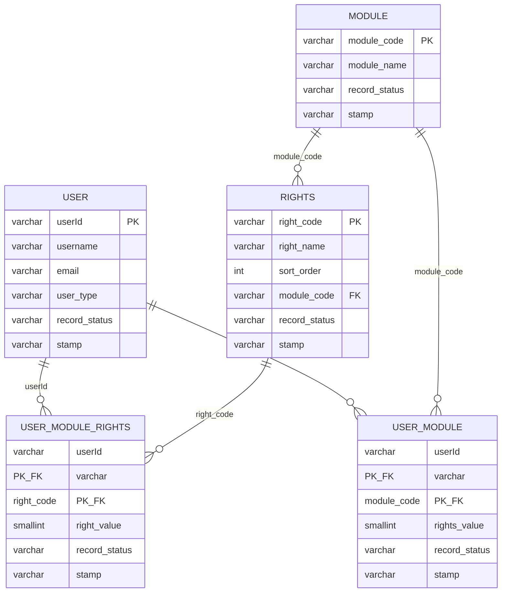

# HopeSMS Database ERD

Sprint 1 M3 deliverable for the Hope, Inc. Sales Management System.

This ERD keeps the app's six HopeDB tables as the primary focus, then shows the separate auth and rights seed tables referenced by the project docs.

## Core HopeSMS Tables

```mermaid
erDiagram
    CUSTOMER ||--o{ SALES : "custNo -> custno"
    EMPLOYEE ||--o{ SALES : "empNo -> empno"
    SALES ||--o{ SALESDETAIL : "transNo -> transNo"
    PRODUCT ||--o{ SALESDETAIL : "prodCode -> prodCode"
    PRODUCT ||--o{ PRICEHIST : "prodCode -> prodCode"

    CUSTOMER {
        varchar custno PK
        varchar custname
        varchar address
        varchar payterm
    }

    EMPLOYEE {
        varchar empno PK
        varchar lastname
        varchar firstname
        char gender
        date birthdate
        date hiredate
        date sepDate
    }

    SALES {
        varchar transNo PK
        date salesDate
        varchar custNo FK
        varchar empNo FK
        varchar record_status
        varchar stamp
    }

    PRODUCT {
        varchar prodCode PK
        varchar description
        varchar unit
    }

    SALESDETAIL {
        varchar transNo PK_FK
        varchar prodCode PK_FK
        decimal quantity
        varchar record_status
        varchar stamp
    }

    PRICEHIST {
        date effDate PK
        varchar prodCode PK_FK
        decimal unitPrice
    }
```

## Auth and Rights Tables



## Notes

- Only `sales` and `salesDetail` are structurally extended with `record_status` and `stamp`.
- `customer`, `employee`, `product`, and `priceHist` stay lookup-only.
- `salesDetail` uses a composite primary key: (`transNo`, `prodCode`).
- Current price comes from the latest `priceHist.effDate` for a given `prodCode`.
- The rights side is seeded separately so M4 can later wire auth provisioning and login guard behavior on top of it.
